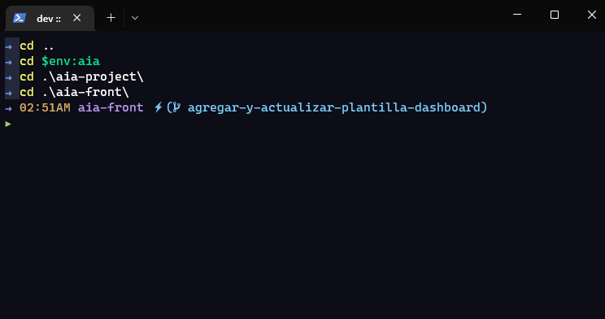

# Powershell

## PSReadLine

Autocompletado de comandos y parámetros. Algo como lo que se puede hacer con el
autocompletado de `zsh`.

- **`[PowerShell`** Gallery |
  PSReadLine](https://www.powershellgallery.com/packages/PSReadLine/)
- **`[YT`** | Transforming PowerShell experience with
  PSReadLine](https://youtu.be/Q11sSltuTE0)
- **`[Stack`** Overflow | Windows Terminal/Powershell
  Intellisense](https://stackoverflow.com/questions/63208417/windows-terminal-powershell-intellisense)
- **`[GitHub`** | PSReadLine](https://github.com/PowerShell/PSReadLine)

### Uso

En el repositorio de GitHub hay una sección que incluye su uso y algunos
ejemplos para mejorar la experiencia de autocompletado. En mi caso, seguí los
pasos para aplicar esos usos.

> [GitHub | PSReadLine > Usage](https://github.com/PowerShell/PSReadLine#usage)

## oh-my-posh

Tema para Powershell. Algo como lo que se puede hacer con `oh-my-zsh`.

> [Oh My Posh](https://ohmyposh.dev/)

### Temas favoritos

- **`jandedobbeleer`**: Lo utilicé por mucho tiempo. Me gustan los colores,
  íconos y que indique datos como la hora, duración del proceso que se ejecutó,
  versión de Node, sistema de control de versiones (GitHub, GitLab, etc.), y
  más.
- **`tokyonight_storm`**: Es un tema minimalista que indica el directorio actual
  y la rama en la que nos encontramos. No dice los cambios que tenemos en la
  rama, pero cambia de color la fuente de la rama cuando los hay. Además, al
  ejecutar un comando, se elimina el directorio de la línea de comandos y se
  muestra el comando que se haya ejecutado nada más. Así hay un historial en la
  terminal más limpio, aunque puede llegar a ser poco informativo.
- **`json`**
- **`material`**
- **`spaceship`**

### Formato personalizado

Lo utilicé para mostrar la hora actual. Modifiqué el tema `tokyonight_storm` y
añadí el formato de hora que quería mostrar. Tal como se menciona en la
documentación, se utiliza el
[golang standard](https://yourbasic.org/golang/format-parse-string-time-date-example/).

En mi caso, definí una plantilla para la hora siguiendo el estándar: `03:04PM`.
Dentro `blocks.segments` definí el formato. Además, utilicé un color que estaba
definido en el tema.

```json
{
  "palette": {
    ...,
    "terminal-yellow": "#e0af68",
    ...
  },
  "blocks": [
    {
      "alignment": "left",
      "segments": [
        {
          "type": "text",
          "style": "plain",
          "background": "transparent",
          "foreground": "p:terminal-blue",
          "template": "\u279c "
        },
        {
          "type": "time",
          "style": "plain",
          "foreground": "p:terminal-yellow",
          "properties": {
            "time_format": "03:04PM"
          },
          "template": "{{ .CurrentDate | date .Format }} "
        },
        ...
      ]
    }
  ]
}
```



## posh-git

Muestra información de Git en la terminal y permite el autocompletado de
comandos.

> [GitHub | posh-git](https://github.com/dahlbyk/posh-git)
